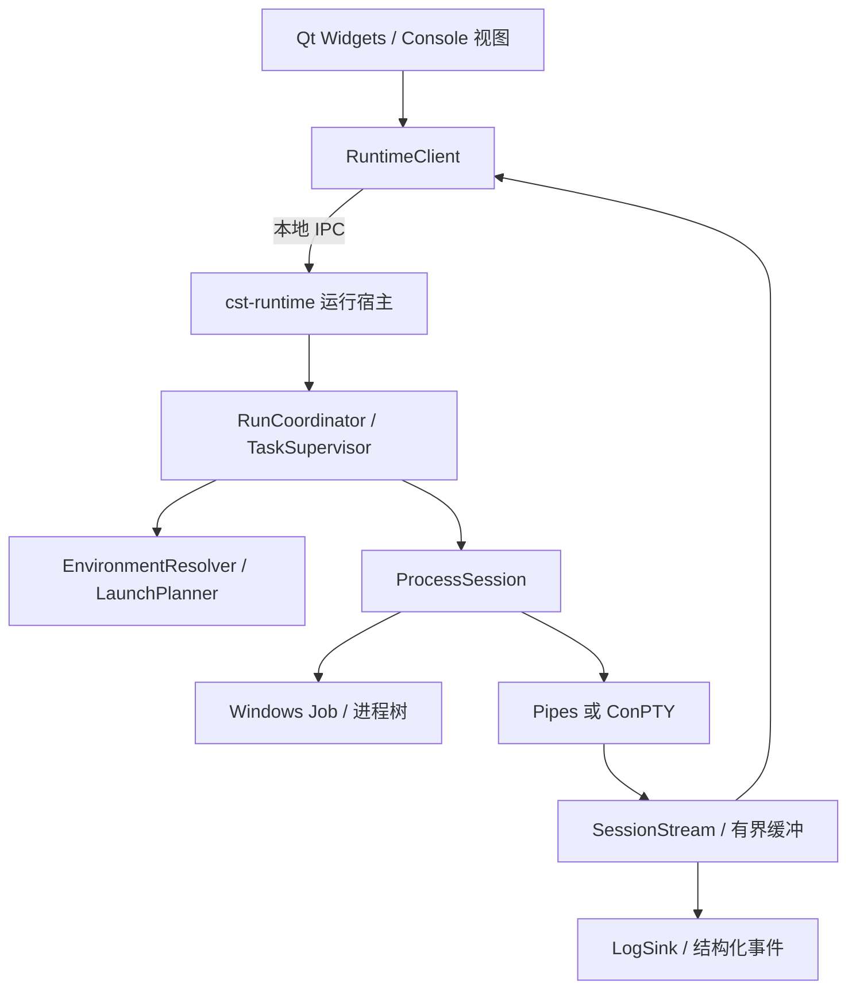

# CST 启动、进程托管与 Console 重设计

日期：2026-09-19。状态：初始设计记录；实施后的字段、模块边界和测试范围见 [Runtime v2 实现说明](runtime-v2.md)。本文回应本次“分析并重新设计”的要求；示例是拟议 v2 格式，不能直接导入现有程序。本记录中的概念示例不作为当前导入格式；当前 Schema 和 Runtime v2 实现说明优先。

产品目标：用户选择项目环境和运行命令，即可得到与命令行工具一致的执行行为；项目进程、运行窗口和日志各有明确生命周期。保留 Windows / C++20 / Qt Widgets，先维持单项目运行，不把这次重构扩大成多项目集群调度。

“Python 虚拟机”在本文按 Python venv 虚拟环境理解。用户已明确：关闭主窗口时停止项目，各任务和 console 独立管理。关闭单个 console 视图不停止任务，可在主窗口仍运行时重新打开；本次不提供关闭主窗口后后台继续运行的模式。

## 1. 现状与根因

当前主要路径：`main.cpp` 在 GUI 进程内构造运行服务、监督器和 Windows runner；`ProjectRuntimeService::start` 执行预检、端口回收和任务启动；`TaskSupervisor` 同时解释 JSON、合并环境、查找工具、拼接 shell、执行准备命令和监督服务；runner 创建 Job、隐藏 console 和输出管道；输出经 GUI 连接进入 LogService，再显示到文本控件。

| 证据位置 | 当前行为 | 实际影响 |
|---|---|---|
| `src/application/TaskSupervisor.cpp`：`command` | 在 `call activate.bat` 前把 program 解析为绝对路径 | `python` 可能已固定成全局解释器，激活后的 PATH 无法改变它；全局没有 Python 时甚至提前失败 |
| 同上：PATH 合并；`WindowsProcessRunner.cpp`：`resolveExecutable` | 无论 `inheritSystem` 如何都追加启动器 PATH；查找程序使用启动器环境而非最终命令环境 | 配置环境与实际查找环境不同；用户设置 PATH 不能可靠选择工具，隔离失效 |
| `TaskSupervisor.cpp`：`toolSearchDirectories` | 应用层猜测 npm/pnpm/Node 常见安装目录 | 生态工具知识侵入监督器；命中哪个版本不透明 |
| `TaskSupervisor.cpp`：`preflight` | 准备步骤运行前检查所有目录、激活脚本并解析所有程序 | “准备步骤创建 .venv，随后执行 .venv 内 Python”会被过早拒绝 |
| `TaskSupervisor.cpp`：`command`；`WindowsProcessRunner.cpp`：`start/resolveExecutable` | exec 禁止批处理；激活又把 exec 转为 cmd 字符串，复用 Windows argv 引用函数 | npm.cmd 被迫走 shell；argv 与 cmd 的元字符/变量展开规则混在一起，不能保证参数原样传递 |
| `TaskSupervisor.cpp`：`launch/tick` | 创建进程即 Running；根进程退出即清理 Job；1500 ms 内退出一律启动失败 | 根启动器交接给子进程会被误杀；无法表达正常短任务；固定时长不能代表就绪或失败原因 |
| `WindowsProcessRunner.cpp`：`ManagedProcess` | stdin=NUL，stdout/stderr=pipe，隐藏的新 console；按换行输出 | 无交互输入、尺寸同步或终端屏幕；无换行提示被延迟，进度回写和 ANSI 光标移动无法正确显示 |
| 同上：`empty/terminate/read` | Job 存活与管道读取结束合成一个 empty；停止循环无截止时间 | 进程已退出和输出尚未排空无法区分；异常句柄/读线程状态可能让停止永久等待 |
| 同上：`stop`；`helpers/signal-helper/main.cpp` | 仅根进程活着时附着其 console 并广播 CTRL_BREAK；未使用 helper 退出结果 | 根已退出但子进程仍活着时失去优雅停止路径；CTRL_BREAK 不等同交互 Ctrl+C |
| `src/app/main.cpp`：processOutput 连接 | 消费输出时读取当前 project/operationId | 停止操作或排队输出可能改变归属；日志缺少一次运行与一次重启的固定身份 |
| `LogService.cpp`；`AdminPage.cpp` | 每条输出排队写文件/flush，再逐条更新文本控件 | UI 的 5000 行限制没有限制此前的事件队列；大量输出可能积压 |
| `main.cpp`；`ProjectRuntimeService.cpp`：`close` | GUI 拥有所有运行对象，关闭即停止，析构仍负责清理 | 关闭即停止符合产品要求；需分离任务、终端视图和资源所有权，使正常关闭通过显式停止协议完成 |

已有值得保留的机制：挂起创建进程、加入 Job 后恢复、限制继承句柄、Job kill-on-close、准备步骤失败短路、逆序停止、滑动窗口重启预算、异步操作队列和日志轮转。问题主要在职责及语义边界，不需要放弃 Win32 Job。

以上为静态代码分析，未在 Windows 复现；特别是停止挂起、参数边界和事件积压需要夹具验证，不能当作已完成的实机测试结论。

## 2. 对齐 uv、venv、npm 的执行语义

| 运行方式 | CST 的职责 | 保留给原工具的职责 |
|---|---|---|
| 普通 executable | 在最终环境中解析程序，保持 argv 边界、cwd、退出结果 | 程序内部行为 |
| Python venv | 定位指定环境的 `Scripts/python.exe`；设置 Scripts PATH、VIRTUAL_ENV，移除冲突的 PYTHONHOME | Python 的包隔离和解释器行为；环境创建/安装用显式准备步骤 |
| uv | 定位 uv，传递 `run`、工具选项、`--` 和目标 argv，保留调用目录 | 环境创建/同步、项目发现、锁文件和依赖解析 |
| npm script | 定位 Node/npm 安装，调用原 npm CLI，传递 script、workspace 和 `--` 后的参数 | scripts、pre/post 生命周期、包根目录、node_modules/.bin PATH 和 script-shell |
| 显式 shell | 指定 shell 类型、脚本和 cwd；用户脚本按该 shell 语义执行 | shell 的语法、变量和重定向 |

不要为 npm 手工解析 package.json 后直接启动 vite，也不要在 uv 模式先解析其目标 `python` 为系统绝对路径。工具目标的解析应留在 uv/npm 内部。

参考依据：uv 在 run 前维护项目环境，并保留父启动器处理部分信号；venv 不要求先执行激活脚本；npm run 为脚本增加本地二进制目录并具有自己的 shell、工作目录和生命周期语义。见 [uv run](https://docs.astral.sh/uv/concepts/projects/run/)、[Python venv](https://docs.python.org/3/library/venv.html)、[npm 官方命令文档源码](https://raw.githubusercontent.com/npm/cli/latest/docs/lib/content/commands/npm-run.md)。

## 3. 三个独立的设计维度

1. **如何启动**：executable、python-venv、uv、npm、shell。
2. **如何存活**：一次性 task / 长期 service；以根进程或 Job 进程树作为存活范围；主窗口关闭统一停止整个项目。
3. **如何交互**：pipes 日志 / terminal 终端；视图打开、关闭、重新附着不创建或销毁运行。

本次“分离”指每个任务拥有独立的进程树和 I/O session，各 console 视图独立开关；项目整体仍受主窗口生命周期约束。命令类型、任务存活和视图状态分别建模，不能继续塞进 `mode=exec|shell`。



这次采用一个受主窗口生命周期约束的运行宿主承载当前项目，各 task attempt 独立 Job 和 I/O session。宿主进程用于隔离阻塞 I/O、进程清理和 GUI，不是后台常驻服务。不要每个模块都变成进程；生态适配器是内建编译模块，不引入动态插件系统。

## 4. 启动计划与环境

核心数据改为强类型；JSON 只在配置读写边界存在。

```cpp
struct RunIdentity { ProjectId project; RunId run; TaskId task; AttemptId attempt; };
struct LaunchIntent { Invocation invocation; WorkingDirectory cwd; EnvironmentRef environment; };
struct LaunchPlan { AbsolutePath application; Argv argv; EnvironmentSnapshot env;
                    AbsolutePath cwd; IoPolicy io; StopPolicy stop; RunIdentity identity; };

// 概念接口，错误、异步返回和所有权类型在实现时补齐。
EnvironmentSnapshot EnvironmentResolver::resolve(const EnvironmentSpec&, const RunContext&);
LaunchPlan LaunchPlanner::resolve(const LaunchIntent&, const EnvironmentSnapshot&);
SessionId ProcessBackend::spawn(const LaunchPlan&);
void SessionControl::writeInput(SessionId, ByteSpan);
void SessionControl::resize(SessionId, TerminalSize);
void SessionControl::requestStop(SessionId, Deadline);
```

环境优先级：显式选定的基础环境 → 项目 envFiles/variables → 任务覆盖 → 命令覆盖 → provider 保留项 → CST 身份变量。保留项冲突返回字段错误，不悄悄覆盖；venv Scripts PATH 属于 provider 保留前缀。`inheritSystem=false` 时不再暗中注入用户 PATH；所需系统变量通过明确 allowlist 提供。

宿主启动环境和用户环境不能混淆。每次 run 接收客户端环境快照作为可选基础，或使用已保存的明确配置；不能永远沿用后台宿主第一次启动时的 PATH。快照仅驻内存，诊断只输出脱敏差异和路径来源。

解析顺序：

1. 保存配置时校验类型、必填关系、依赖图、路径语法和策略组合。
2. 启动时创建不可变配置 revision 与 runId；检查项目根目录、基础工具和依赖环。
3. 执行每个步骤前重新物化该步骤环境，再检查 cwd 和目标程序是否存在。
4. 前一步生成的 venv、构建目录和 env 文件从这一步起可见；失败归属到确切步骤。
5. 生成最终 application / argv / cwd / env，再交给 backend；backend 不再猜工具目录。

裸程序名只查找最终 PATH；`./tool.exe` 相对命令 cwd 解析，绝对路径直接验证。工具诊断展示候选、最终命中路径、来源及版本探测结果，不将静态默认安装位置写进 TaskSupervisor。

Windows 路径与参数分开处理：原生 executable 用 argv 编码；显式 shell 保留独立脚本字段。npm 优先通过已验证安装内的 `node.exe + npm-cli.js` 避开 npm.cmd 外层引用；找不到匹配 CLI 时给出可修复的工具配置错误，不猜任意 npm 内部路径。普通 `.cmd/.bat` 属于明确 batch 适配路径，其编码单独测试，不能复用 CRT 引号算法并声称透明。

旧 activationScript 仅作为 `legacy-shell` 兼容路径保留，注明 shell 参数限制。不要自动执行任意激活脚本后抓取 `set` 输出伪装成通用环境接口；venv 直接迁移为环境描述，自定义激活脚本由显式 shell 运行。

## 5. 任务、进程树与状态

任务编排与进程机制拆开：`TaskSupervisor` 只判断依赖、结果、重启与取消；`ProcessSession` 提供根进程状态、Job 活跃进程集合、输出流状态和控制能力。

| 策略 | 语义 |
|---|---|
| `kind=task` | 成功退出是 Completed；不套用服务重启逻辑；根退出后默认清理遗留后代，清理完成才能完成步骤 |
| `kind=service, lifetime=root` | 默认兼容 uv/npm 前台启动链；根进程意外退出结束本次 attempt 并清理后代 |
| `kind=service, lifetime=tree` | 显式支持启动器退出、工作进程留在同一 Job 的交接；Job 清空才结束；记录根退出结果并按配置判断交接是否允许 |
| `readiness=none` | 已运行只代表存活，不代表 URL 可用 |
| `readiness=tcp/http` | 可选；探针成功才 Ready，超时结束 attempt；不把端口“被任意进程监听”等同本任务就绪 |

tree 模式不能靠任意残留 helper 宣告成功：应配置 readiness 或明确接受仅进程树存活；根非成功退出默认视为失败，即使有残余进程。跨 Job 的独立 daemon 不属于托管交接；确需管理已有服务时必须另设服务控制接口，不能靠 PID 猜测收养。

任务状态分为 `Pending → Preparing → Starting → Running → Stopping → Exited`；Exited 带 Success/Failure/Cancelled 原因，服务策略可进入 Backoff 后创建新 attempt。就绪是独立状态 `Unknown/Waiting/Ready/Unready`。项目状态由必要任务结果和存活情况归约，避免把 Starting 事件当作 Ready。

依赖用 `dependsOn: completed|started|ready` 明确条件，v2 首轮仍串行调度拓扑序；循环及无效条件在启动前拒绝。重启只重做当前 service attempt；依赖变为 unready 时暂停尚未启动的下游，已运行下游默认保留并显示依赖异常；必要任务最终失败则逆序停止整个项目，避免隐含的重启级联。

删除固定 1500 ms 失败判据。重启策略显式指定 `never/on-failure/always`、预算、退避、成功运行多久重置预算和启动超时；正常短任务不重启，长期服务退出码 0 如何处理由 policy 决定。停止一经接受即封锁所有新 attempt，迟到的启动结果也必须清理。

Job emptiness、root result、stream EOF 三个事件分别记录。重启前确认旧 Job 清空；输出排空有独立有限 deadline。停止失败进入 CleanupFailed 并保留控制句柄，不把未完成清理报告为 Stopped；禁止此时同步和覆盖项目目录。

## 6. GUI 与运行宿主分离

`cst.exe` 持有客户端和视图；`cst-runtime.exe` 持有配置 revision、运行状态、项目锁、Job、ConPTY/pipe、重启计时器和日志。宿主是 GUI 会话内的辅助进程，不跨主窗口退出存活。Job 句柄只归宿主，保留 kill-on-close：宿主崩溃清理托管进程；GUI 崩溃时宿主检测所有者退出并停止项目。所有者以启动握手绑定的进程句柄和会话身份识别，不仅记录可复用的 PID。

本地 IPC 使用命名管道，协议版本握手，限定同一 Windows 用户和会话的访问；请求具有 requestId、runId、revision，重复 Start 返回原运行，Stop 幂等。客户端不得凭任意 PID 发起进程控制。需要管理员端口操作时分离受限提权助手；正常项目运行使用普通用户权限，使 Python/npm 缓存和工具路径与用户终端一致。

最小协议：`GetSnapshot / StartRun / StopRun / Subscribe(afterSeq) / WriteInput / ResizeTerminal / Detach`。结构化状态与输出传输分开限流；snapshot 含 sequence 水位，订阅从该位置补齐；环形缓冲已覆盖旧数据时返回 Gap，不能假装完整重放。

每个会话最多一个输入/尺寸控制者，可有多个只读视图；控制权转移显式发生。console 视图关闭仅释放该视图的订阅和控制权，不关闭 I/O；主窗口内重新打开视图时恢复 task/attempt/terminal 对应关系。视图订阅断开与主窗口所有者退出必须是不同事件。

关闭策略固定为 stop，新旧项目一致，不暴露 onUiClose 选项。关闭主窗口立即进入 Closing，拒绝新启动和重启，取消准备步骤，逆序请求各任务停止；宽限期结束后强杀残余 Job，确认 Job 清空并在有限期限内排空输出后，宿主回复 CloseReady，GUI 才退出并回收宿主。GUI 等待期间保持响应；清理失败显示具体任务和错误，不伪报退出成功。独立 console 窗口不能延长主窗口或项目的寿命。

GUI 异常退出、注销或系统关机同样触发清理。宿主监视所有者进程退出；主控制通道异常中断时进入有界恢复期，期间禁止新变更，仅允许同一所有者恢复连接，期限结束启动停止流程。普通 console 订阅断开不触发该机制。主窗口仍存活但未运行项目时宿主可以保留；关闭完成后必须退出。

同步、配置激活等会影响运行文件的操作由宿主统一串行授权和加锁；编辑草稿可以在 GUI 进行，运行使用原 revision。不能只把进程搬到后台，却让 GUI 中的同步服务绕过运行锁。

## 7. Console 与日志分开

**Pipes 模式**：适合非交互服务和自动任务，保留 stdout/stderr 分离；配置 stdin 为 closed 或 pipe，字节块立即投递，日志订阅者再按行组装。编码配置为 UTF-8 或明确 codepage，采用增量解码，避免每行猜测编码造成不稳定；无换行输出按刷新间隔显示，不等待 1 MiB 阈值。

**Terminal 模式**：使用 ConPTY 提供真实终端会话，宿主持有伪控制台，GUI 使用独立 TerminalView / 终端屏幕模型处理 VT 序列、光标、回写、清屏、输入、尺寸和滚动历史。不能把 QPlainTextEdit 加颜色就视为终端。ConPTY 提供 UTF-8/VT 数据通道，宿主负责持续读写及 resize；它本身不提供 Qt 终端控件。实现前需验证终端解析组件的许可证与兼容性；最小交付必须覆盖下述验收矩阵，不宣称未测试的全屏 TUI 兼容。

ConPTY 流不保留原始 stdout/stderr 分离，事件标为 terminal；不能从颜色反推 channel。关闭视图不关闭 HPCON；停止时继续排空输出，并把可能阻塞的伪控制台关闭放在工作线程，读写分别驱动，避免互等。依据：[Microsoft ConPTY 会话生命周期](https://learn.microsoft.com/en-us/windows/console/creating-a-pseudoconsole-session)。

输入中的 Ctrl+C 是 terminal 交互；“停止任务”是生命周期请求，两者分开。停止策略可用应用控制命令、终端输入或附着专属 console 发送控制事件；失败/超时后终止 Job。控制事件只能影响共享该 console 的进程，CTRL_BREAK 不能承诺具有 Ctrl+C 的应用行为；记录发送结果，并用 Job 状态确认是否退出。依据：[GenerateConsoleCtrlEvent](https://learn.microsoft.com/en-us/windows/console/generateconsolectrlevent)。

输出事件从创建时就携带固定 `projectId/runId/taskId/attemptId/sessionId/seq/channel/timestamp`；停止请求另有 requestId。禁止日志消费者读取“当前项目/当前操作”补身份。

终端实时流、滚动记录和结构化诊断是不同订阅者。原始终端数据只作有界内存回放，默认不落盘、不进诊断包，输入不记日志；持久日志进行脱敏，跨 chunk 的敏感内容由带有限延迟的连续文本过滤处理，不能逐块替换后声称不会泄漏。

每 session 建议 8 MiB 输出环，单消费者另有上限；UI 每 16–50 ms 批量消费，日志批量写入。读管道不等待 UI；消费者落后则丢弃其旧数据并发送 Gap，记录丢失数量。状态/退出事件走可靠控制通道。磁盘故障返回诊断事件，继续排空子进程，避免把日志故障变成应用死锁。终端视图的原始内容与脱敏日志存在差异，应在 UI 中清楚区分。

## 8. 拟议 v2 配置示例

以下片段展示组合方式；不是完整 Schema，也不是当前可导入格式。cwd/venv 相对路径以 workspaceRoot 为基准，命令级 cwd 仍可覆盖。

```json
{
  "schemaVersion": 2,
  "project": {
    "id": "demo",
    "workspaceRoot": "C:/Projects/demo",
    "environments": {
      "base": { "inheritSystem": true },
      "py": { "extends": "base", "venv": "./backend/.venv" }
    },
    "tasks": [
      {
        "id": "setup-python", "kind": "task",
        "environment": "base", "cwd": "./backend",
        "run": { "type": "executable", "program": "python", "args": ["-m", "venv", ".venv"] },
        "timeoutMs": 120000, "successExitCodes": [0],
        "io": { "mode": "pipes", "stdin": "closed" }
      },
      {
        "id": "api", "kind": "service", "environment": "py", "cwd": "./backend",
        "dependsOn": [{ "task": "setup-python", "condition": "completed" }],
        "run": { "type": "python-venv", "args": ["-m", "app"] },
        "lifetime": "root", "readiness": { "type": "none" },
        "restart": { "when": "on-failure", "maxAttempts": 3, "windowMs": 60000, "backoffMs": 1000 },
        "io": { "mode": "terminal" }
      },
      {
        "id": "web", "kind": "service", "environment": "base", "cwd": "./frontend",
        "run": { "type": "npm", "script": "dev", "args": ["--host", "127.0.0.1"] },
        "lifetime": "root", "readiness": { "type": "none" },
        "restart": { "when": "never" }, "io": { "mode": "terminal" }
      }
    ]
  }
}
```

uv 项目用 `{"type":"uv","options":["--locked"],"command":["python","-m","app"]}`，物化为 `uv run --locked -- python -m app`，不再配 Python activationScript；依赖安装由 uv 执行。npm 示例假定项目依赖已安装，需要自动安装时新增显式 `npm ci` 准备任务。直接 venv 模式同样只选择环境，不隐式安装应用依赖。

端口策略独立为 `fail/reclaimOwned/reclaimConfigured`；新项目建议 fail，旧配置迁移保留现有显式端口回收行为。端口占用与 readiness 分开，权限不足给出具体占用者和可执行诊断。

## 9. 代码迁移次序与边界

以下是连续实施顺序，不是每一步都要重新批准。

1. 提取 `EnvironmentResolver / ExecutableResolver / LaunchPlanner`，先修最终 PATH、激活前解析、过早 preflight；保持现有 GUI 能运行。
2. 新增强类型 v2 配置及 v1 importer，拆分 task/service。prepareCommands 按原顺序生成 task，serviceCommand 依赖最后一个 prepare；旧 order 转成串行依赖。旧 shell 原文保留，禁止自动拆词。
3. 拆开 Windows `ManagedProcess` 为 JobController、ProcessSession、PipeTransport；将结果、进程树状态、流状态分离，加入停止期限和 attempt 身份。保留现有 Job 清理测试并扩充。
4. 加入 cst-runtime、RuntimeClient 和 IPC，将监督、日志及运行锁迁到宿主；MainWindow 保留关闭即停止语义，改为异步 StopAll/CloseReady 协议，加入 GUI 所有者退出监视；更新单实例路由、安装打包和宿主退出清理。
5. 加入 ConPTYTransport、TerminalView 和恢复订阅；任务页面分别编辑“命令 / 环境 / 生命周期 / 终端”，用户页按任务打开终端。诊断页保留可搜索日志。
6. 移除 TaskSupervisor 内工具猜测和 shell 拼接，更新 Tech.md、README、Schema、示例、Windows 测试步骤及两套构建入口。v1 备份后原子迁移，保留报告；不识别的 activationScript 留在兼容模式，不能悄悄改写。

旧 1500 ms 阈值和启动即 Running 在迁移报告中明确列为语义变更；v1 未配置 probe 保持 readiness=none。环境不继承却回灌 PATH 属于 bug 修复，报告新命中路径，缺工具时要求配置工具路径。先完成 npm/uv/venv 的真实调用，再删除旧路径，不能用假 runner 测试替代兼容性验收。

## 10. 必须通过的验收场景

| 类别 | 断言 |
|---|---|
| 环境解析 | 系统和任务 PATH 含不同 Python 时命中任务版本；inheritSystem=false 不泄漏系统 PATH；带空格/中文路径正确 |
| 准备阶段 | 新目录下先创建 .venv 再启动；前一步生成 cwd/envFile；准备失败不启动后续服务 |
| 工具一致性 | 对比命令行的 sys.executable、sys.prefix、cwd、环境和退出码；uv 锁文件不匹配报错；npm 本地 bin、pre/post、workspace、`--` 参数正确 |
| 参数 | 空参数、空格、引号、尾随反斜杠、中文、`& | < > ^ % !`；原生 exec 无 shell 副作用，batch 限制可诊断 |
| 生命周期 | task 短暂成功即 Completed；root/tree 模式下父退出子存活分别符合策略；异常根退出、Job 清空和 readiness 超时可区分 |
| 重启取消 | 停止发生在 spawn/prepare/backoff 时不产生孤儿；attempt 不混日志；超预算逆序清理，旧 Job 未清空不重启 |
| 进程分离 | 关闭单个 console 不影响任务和其他终端，重新打开恢复状态；关闭主窗口取消准备/重启并清空所有 Job 后退出；GUI 崩溃触发宿主清理，宿主崩溃杀整棵 Job；独立 console 不阻止项目停止；重复 Start/Stop 幂等 |
| 终端 | Python REPL、npm 颜色和回写、无换行输入提示、中文跨块解码、resize、Ctrl+C、重新附着；pipes 保持双通道 |
| 停止边界 | 根退出后仍能停止树；忽略控制事件时截止时间后强杀；持有输出句柄/大量输出时不永久阻塞；CleanupFailed 不显示停止成功 |
| 压力与归属 | 慢 UI/磁盘下持续大输出内存有界、Gap 可见；操作切换不改变旧输出身份；跨块脱敏、重连序列无重复或静默缺口 |
| 权限与 IPC | 普通用户项目不提升；不同用户不能连接控制；每次 run 的客户端 PATH 生效；同步受宿主运行锁保护；主控制通道失联有界恢复后停止，关闭输出订阅不误触发停止 |

通用单元测试验证计划和状态；Windows 10/11 真实集成测试验证 CreateProcess、Job、ConPTY、IPC 和生态工具。Linux 测试通过不能代替这些验收。
